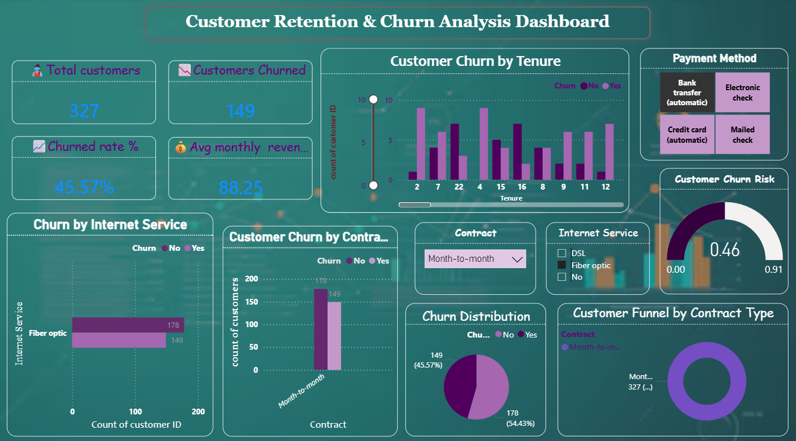

# 📉 Customer Retention & Churn Analysis Dashboard

## Future Interns Internship – Task 2

## 📌 Overview

This dashboard provides a comprehensive view of customer retention and churn patterns for an internet service provider. Built using the **Telco Customer Churn Dataset (Kaggle)** , it highlights how customer behavior, internet service type, contract duration, and payment preferences influence churn. The goal is to identify actionable insights that can help reduce churn and improve customer loyalty.

---

## 📊 Key Metrics

| Metric | Value |
|--------|-------|
| **Total Customers** | 327 |
| **Customers Churned** | 149 |
| **Churn Rate** | 45.57% |
| **Avg Monthly Revenue per Customer** | ₹88.25 |

---

## 🔍 Key Insights

### 1. Churn Rate
- **45.57%** of customers have churned
- **54.43%** remain active

### 2. Internet Service Impact
- **Fiber optic** users show the highest churn count (**178** customers)
- DSL and "No internet service" categories show comparatively lower churn

### 3. Contract Type
- **Month-to-month** contract customers account for **149** churned customers (45.57% of total)
- Long-term contracts show significantly better retention

### 4. Payment Methods
Four payment methods analyzed:
- Bank transfer (automatic)
- Electronic check
- Credit card (automatic)
- Mailed check

### 5. Churn Risk Score
- Identified risk levels: **0.46** and **0.91**
- Helps prioritize high-risk customers for retention campaigns

### 6. Customer Distribution
- **Churned:** 149 customers
- **Retained:** 178 customers
- Clear funnel visualization showing churn vs retention

---

## 🖥️ Dashboard Features

| Feature | Description |
|---------|-------------|
| **KPIs** | Total customers, customers churned, churn rate %, avg monthly revenue |
| **Churn by Internet Service** | Bar chart comparing Fiber optic, DSL, and No service |
| **Churn by Contract Type** | Analysis of Month-to-month vs long-term contracts |
| **Payment Method Analysis** | Breakdown of churn across 4 payment methods |
| **Churn Risk Indicators** | Risk scores at 0.46 and 0.91 |
| **Customer Distribution** | Donut/bar chart showing Churn vs No Churn (149 vs 178) |

## 🛠️ Tools Used

- **Power BI** / **Excel** (as applicable)
- **Kaggle** – Dataset source
